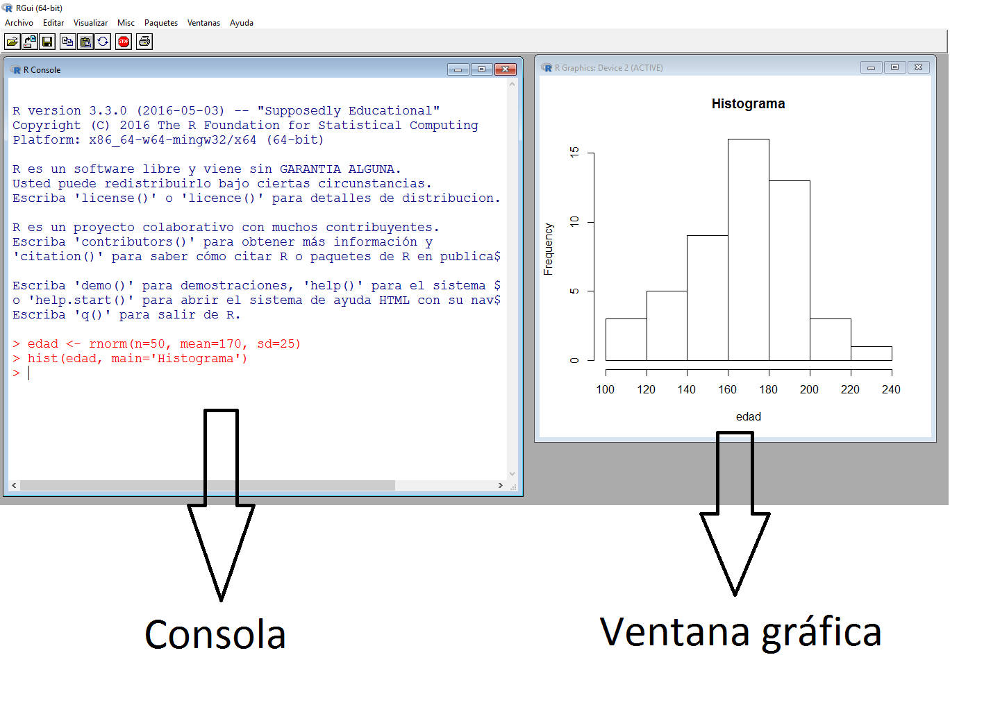

\mainmatter

# Introducción \label{intro}

\section{Orígenes} \label{sec:origenes}
R es un lenguaje de programación usado para realizar procedimientos estadísticos y gráficos de alto nivel, este lenguaje fue creado en 1993 por los profesores e investigadores Robert Gentleman y Ross Ihaka. Inicialmente el lenguaje se usó para apoyar los cursos que tenían a su cargo los profesores, pero luego de ver la utilidad de la herramienta desarrollada, decidieron colocar copias de R en StatLib. A partir de 1995 el código fuente de R está disponible bajo licencia GNU GPL para sistemas operativos Windows, Macintosh y distribuciones Unix/Linux. La comunidad de usuarios de R en el mundo es muy grande y los usuarios cuentan con diferentes espacios para interactuar, a continuación una lista no exhaustiva de los sitios más populares relacionados con R:

- [Rbloggers](https://www.r-bloggers.com/).
- [Comunidad hispana de R](http://r-es.org/).
- [Nabble](http://r.789695.n4.nabble.com/).
- [Foro en portugués](http://r-br.2285057.n4.nabble.com/).
- [Stackoverflow](http://stackoverflow.com/questions/tagged/r).
- [Cross Validated](http://stats.stackexchange.com/questions/tagged/r).
- [R-Help Mailing List](https://stat.ethz.ch/mailman/listinfo/r-help).
- [Revolutions](http://blog.revolutionanalytics.com/).
- [R-statistics blog](https://www.r-statistics.com/).
- [RDataMining](https://rdatamining.wordpress.com/).

```{r, echo=F, fig.cap='Robert Gentleman (izquierda) y Ross Ihaka (derecha) creadores de R.', out.width = '50%', fig.align='center'}
knitr::include_graphics("images/Robert_Roos.png")
```

\section{Descarga e instalación} \label{sec:descarga}

Para realizar la instalación de R usted debe visitar la página del CRAN (\textit{Comprehensive R Archive Network}) disponible en este [enlace](https://cran.r-project.org/). Una vez ingrese a la página encontrará un cuadro similar al mostrado en la Figura \@ref(fig:cran) donde aparecen los enlaces de la instalación para los sistemas operativos Linux, Mac y Windows.

```{r cran, echo=F, fig.cap='Página del Cran.', dpi=190, fig.align='center'}
knitr::include_graphics("images/cran.png")
```

Supongamos que se desea instalar R en Windows, para esto se debe dar clic sobre el hiperenlace \textcolor{BurntOrange}{Download R for Windows} de la Figura \@ref(fig:cran). Una vez hecho esto se abrirá una página con el contenido mostrado en la Figura \@ref(fig:inst1). Una vez ingrese a esa nueva página usted debe dar clic sobre el hiperenlace \textcolor{BurntOrange}{install R for the first time} como es señalado por la flecha roja en la Figura \@ref(fig:inst1).
  
```{r inst1, echo=F, fig.cap='Página de instalación para la primera ocasión.', dpi=190, fig.align='center'}
knitr::include_graphics("images/instalacion1.png")
```

Luego de esto se abrirá otra página con un encabezado similar al mostrado en la Figura \@ref(fig:inst2), al momento de capturar la figura la versión actual de R era 3.2.5 pero seguramente en este momento usted tendrá disponible una versión actualizada. Una vez allí uste debe dar clic sobre \textcolor{BurntOrange}{Download R 3.2.5 for Windows} como es señalado por la flecha verde. Luego de esto se descargará el instalador R en el computador el cual deberá ser instalado con las opciones que vienen por defecto.

```{r inst2, echo=F, fig.cap='Página de descarga.', out.width = '50%', fig.align='center'}
knitr::include_graphics("images/instalacion2.png")
```

Se recomienda observar el siguiente video didáctico de instalación de R disponible en este [enlace](http://tinyurl.com/jd7b9ks) para facilitar la tarea de instalación.

\section{Apariencia del programa} \label{sec:apariencia}
Una vez que esté instalado R en su computador, usted podrá acceder a él por la lista de programas o por medio del acceso directo que quedó en el escritorio, en la Figura \@ref(fig:rlogo) se muestra la apariencia del acceso directo para ingresar a R.

```{r rlogo, echo=F, fig.cap='Apariencia del acceso directo para ingresar a R.', out.width = '33%', fig.align='center'}
knitr::include_graphics("images/rlogo.png")
```

Al abrir R aparecerá en la pantalla de su computador algo similar a lo que está en la Figura \@ref(fig:pantalla). La ventana izquierda se llama consola y es donde se ingresan las instrucciones, una vez que se construye un gráfico se activa otra ventana llamada ventana gráfica. Cualquier usuario puede modificar la posición y tamaños de estas ventanas, puede cambiar el tipo y tamaño de las letras en la consola, para hacer esto se deben explorar las opciones de \textit{editar} en la barra de herramientas.

```{r pantalla, echo=F, fig.cap='Apariencia de R.', dpi=400, fig.align='center'}

```


\section{Tipos de objetos} \label{sec:objetos}

En R existen varios tipos de objectos \index{objetos} que permiten que el usuario pueda almacenar la información para realizar procedimientos estadísticos y gráficos. Los principales objetos en R son vectores, matrices, arreglos, marcos de datos y listas. A continuación se presentan las características de estos objetos y la forma para crearlos.

\subsection{Vectores}

Los vectores \index{vectores} son arreglos ordenados en los cuales se puede almacenar información de tipo numérico (variable cuantitativa), alfanumérico (variable cualitativa) o lógico (`TRUE` o `FALSE`), pero no mezclas de éstos. La función de R para crear un vector es `c()` y que significa concatenar; dentro de los paréntesis de esta función se ubica la información a almacenar. Una vez construído el vector se acostumbra a etiquetarlo con un nombre corto y representativo de la información que almacena, la asignación se hace por medio del operador `<-` entre el nombre y el vector.

A continuación se presenta un ejemplo de cómo crear tres vectores que contienen las respuestas de cinco personas a tres preguntas que se les realizaron.

```{r}
edad <- c(15, 19, 13, NA, 20)
deporte <- c(TRUE, TRUE, NA, FALSE, TRUE)
comic.fav <- c(NA, 'Superman', 'Batman', NA, 'Batman')
```

El vector `edad` es un vector cuantitativo y contiene las edades de las 5 personas. En la cuarta posición del vector se colocó el símbolo `NA` que significa \textit{Not Available} debido a que no se registró la edad para esa persona. Al hacer una asignación se acostumbra a dejar un espacio antes y después del operador `<-` de asignación. El segundo vector es llamado `deporte` y es un vector lógico que almacena las respuestas a la pregunta de si la persona practica deporte, nuevamente aquí hay un `NA` para la tercera persona. El último vector `comic.fav` contiene la información del cómic favorito de cada persona, como esta variable es cualitativa es necesario usar las comillas `' '` para encerrar las respuestas.

```{block2, type='rmdwarning'}
Cuando se usa `NA` para representar una información \textit{Not Available} no se deben usar comillas.
```

```{block2, type='rmdnote'}
Es posible usar comillas sencillas `'foo'` o comillas dobles `"foo"` para ingresar valores de una variable cualitativa.
```

Si se desea ver lo que está almacenado en cada uno de estos vectores, se debe escribir en la consola de R el nombre de uno de los objetos y luego se presiona la tecla \textit{enter} o \textit{intro}, al realizar esto lo que se obtiene se muestra a continuación.

```{r}
edad
deporte
comic.fav
```

\subsection{Matrices}
Las matrices \index{matrices} son arreglos rectangulares de filas y columnas con información numérica, alfanumérica o lógica. Para construir una matriz se usa la función `matrix( )`. Por ejemplo, para crear una matriz de 4 filas y 5 columnas (de dimensión $4 \times 5$) con los primeros 20 números positivos se escribe el código siguiente en la consola.

```{r}
mimatriz <- matrix(data=1:20, nrow=4, ncol=5, byrow=FALSE)
```

El argumento `data` de la función sirve para indicar los datos que se van a almacenar en la matriz, los argumentos `nrow` y `ncol` sirven para definir la dimensión de la matriz y por último el argumento `byrow` sirve para indicar si la información contenida en `data` se debe ingresar por filas o no. Para observar lo que quedó almacenado en el objeto `mimatriz` se escribe en la consola el nombre del objeto seguido de la tecla \textit{enter} o \textit{intro}.

```{r}
mimatriz
```

\subsection{Arreglos}

Un arreglo \index{arreglo} es una matriz de varias dimensiones con información numérica, alfanumérica o lógica. Para construir una arreglo se usa la función `array( )`. Por ejemplo, para crear un arreglo de $3 \times 4 \times 2$ con las primeras 24 letras minúsculas del alfabeto se escribe el siguiente código.

```{r}
miarray <- array(data=letters[1:24], dim=c(3, 4, 2))
```

El argumento `data` de la función sirve para indicar los datos que se van a almacenar en el arreglo y el argumento `dim` sirve para indicar las dimensiones del arreglo. Para observar lo que quedó almacenado en el objeto `miarray` se escribe en la consola lo siguiente.

```{r}
miarray
```

\subsection{Marco de datos}
El marco de datos \index{marco de datos} o \textit{data frame} es uno de los objetos más utilizados porque permite agrupar vectores con información de diferente tipo (numérica, alfanumérica o lógica) en un mismo objeto, la única restricción es que los vectores deben tener la misma longitud. Para crear un marco de datos se usa la función `data.frame( )`, como ejemplo vamos a crear un marco de datos con los vectores `edad`, `deporte` y `comic.fav` definidos anteriormente.

```{r}
mimarco <- data.frame(edad, deporte, comic.fav)
```

Una vez creado el objeto `mimarco` podemos ver el objeto escribiendo su nombre en la consola, a continuación se muestra lo que se obtiene.

```{r}
mimarco
```

De la salida anterior vemos que el marco de datos tiene 3 variables (columnas) cuyos nombres coinciden con los nombres de los vectores creados anteriormente, los números consecutivos al lado izquierdo son sólo de referencia y permiten identificar la información para cada persona en la base de datos.

\subsection{Listas}

Las listas \index{lista} son otro tipo de objeto muy usado para almacenar objetos de diferente tipo. La instrucción para crear una lista es `list( )`. A continuación vamos a crear una lista que contiene tres objetos: un vector con 5 números aleatorios llamado `mivector`, una matriz de dimensión $6 \times 2$ con los primeros doce números enteros positivos llamada `matriz2` y el tercer objeto será el marco de datos `mimarco` creado en el apartado anterior. Las instrucciones para crear la lista requerida se muestran a continuación.

```{r}
set.seed(12345)
mivector <- runif(n=5)
matriz2 <- matrix(data=1:12, ncol=6)
milista <- list(E1=mivector, E2=matriz2, E3=mimarco)
```

La función `set.seed` de la línea número 1 sirve para fijar la semilla de tal manera que los números aleatorios generados en la segunda línea con la función `runif` sean siempre los mismos. En la última línea del código anterior se construye la lista, dentro de la función `list` se colocan los tres objetos `mivector`, `matriz2` y `mimarco`. Es posible colocarle un nombre especial a cada uno de los elementos de la lista, en este ejemplo se colocaron los nombres `E1`, `E2` y `E3` para cada uno de los tres elementos. Para observar lo que quedó almacenado en la lista se escribe `milista` en la consola y el resultado se muestra a continuación.

```{r}
milista
```

\section{Guía de estilo para la escritura en R} \label{sec:estilo}

Así como en el español existen reglas ortográficas, la escritura de códigos en R también tiene unas reglas que se recomienda seguir para evitar confusiones. Tener una buena guía de estilo \index{guía de estilo} es importante para que el código creado por usted sea fácilmente entendido por sus lectores @rpackages. No existe una única y mejor guía de estilo para escritura en R, sin embargo aquí vamos a mostrar unas sugerencias basadas en la guía llamada \href{https://google.github.io/styleguide/Rguide.xml}{\textit{Google's R style guide}}.

\subsection{Nombres de los archivos}
Se sugiere que el nombre usado para nombrar un archivo tenga sentido y que termine con extensión .R. A continuación dos ejemplos de como nombrar mal y bien un archivo.

\begin{itemize}
	\item Mal: \verb|hola.R|
	\item Bien: \verb|analisis_icfes.R|
\end{itemize}

\subsection{Nombres de los objetos}
Se recomienda no usar los símbolos `_` y `-` dentro de los nombres de objetos. Para las variables es preferible usar letras minúsculas y separar las palabras con puntos (`peso.maiz`) o utilizar la notación camello iniciando en minúscula (`pesoMaiz`). Para las funciones se recomienda usar la notación camello iniciando todas la palabras en mayúscula (`PlotRes`). Para los nombres de las constantes se recomienda que inicien con la letra k (`kPrecioBus`). A continuación ejemplos de buenas y malas prácticas.

Para variables:

\begin{itemize}
	\item Bien: \verb|avg.clicks|
	\item Aceptable: \verb|avgClicks|
	\item Mal: \verb|avg_Clicks|
\end{itemize}

Para funciones:

\begin{itemize}
	\item Bien: \verb|CalculateAvgClicks| 
	\item Mal: \verb|calculate_avg_clicks| , \verb|calculateAvgClicks|
\end{itemize}

\subsection{Longitud de una línea de código}
Se recomienda que cada línea tenga como máximo 80 caracteres. Si una línea es muy larga se debe cortar siempre por una coma.

\subsection{Espacios}
Use espacios alrededor de todos los operadores binarios (=, +, -, <-, etc.). Los espacios alrededor del símbolo ``='' son opcionales cuando se usan para ingresar valores dentro de una función. Así como en español, nunca coloque espacio antes de una coma, pero siempre use espacio luego de una coma. A continuación ejemplos de buenas y malas prácticas.

```{r, eval=F}
tab <- table(df[df$days < 0, 2])  # Bien
tot <- sum(x[, 1])                # Bien
tot <- sum(x[1, ])                # Bien
tab <- table(df[df$days<0, 2])    # Faltan espacios alrededor '<' 
tab <- table(df[df$days < 0,2])   # Falta espacio luego de coma
tab <- table(df[df$days < 0 , 2]) # Sobra espacio antes de coma
tab<- table(df[df$days < 0, 2])   # Falta espacio antes de '<-'
tab<-table(df[df$days < 0, 2])    # Falta espacio alrededor de '<-'
tot <- sum(x[,1])                 # Falta espacio luego de coma
tot <- sum(x[1,])                 # Falta espacio luego de coma
```

Otra buena práctica es colocar espacio antes de un paréntesis excepto cuando se llama una función.

```{r, eval=F}
if (debug)    # Correcto
if(debug)     # Funciona pero no se recomienda
colMeans (x)  # Funciona pero no se recomienda
```

Espacios extras pueden ser usados si con esto se mejora la apariencia del código, ver el ejemplo siguiente.

```{r, eval=F}
plot(x    = x.coord,
     y    = data.mat[, MakeColName(metric, ptiles[1], "roiOpt")],
     ylim = ylim,
     xlab = "dates",
     ylab = metric,
     main = (paste(metric, " for 3 samples ", sep = "")))
```

No coloque espacios alrededor del código que esté dentro de paréntesis `( )` o corchetes `[ ]`, la única excepción es luego de una coma, ver el ejemplo siguiente.

```{r, eval=F}
if (condicion)    # Correcto 
x[1, ]            # Correcto
if ( condicion )  # Sobran espacios alrededor de condicion
x[1,]             # Se necesita espacio luego de coma
```

Los signos de agrupación llaves `{ }` se utilizan para agrupar bloques de código y se recomienda que nunca una llave abierta `{` esté sola en una línea; una llave cerrada `}` si debe ir sola en su propia línea. Se pueden omitir las llaves cuando el bloque de instrucciones esté formado por una sola línea pero esa línea de código NO debe ir en la misma línea de la condición. A continuación dos ejemplos de lo que se recomienda.

```{r, eval=F}
if (is.null(ylim)) {                     # Correcto
  ylim <- c(0, 0.06)
}

if (is.null(ylim))                       # Correcto
  ylim <- c(0, 0.06)

if (is.null(ylim)) ylim <- c(0, 0.06)    # Aceptable

if (is.null(ylim))                       # No se recomienda
{        
  ylim <- c(0, 0.06)
}
	
if (is.null(ylim)) {ylim <- c(0, 0.06)}
# Frente a la llave { no debe ir nada
# la llave de cierre } debe ir sola
```

La sentencia else debe ir siempre entre llaves `} {`, ver el siguiente ejemplo.

```{r, eval=F}
if (condition) {         
  one or more lines
} else {                 # Correcto
  one or more lines
}


if (condition) {         
  one or more lines
}
else {                   # Incorrecto
  one or more lines
}


if (condition)           
  one line
else                     # Incorrecto
  one line
```

\subsection{Asignación}

Para realizar asignaciones se recomienda usar el símbolo `<-`, el símbolo de igualdad `=` no se recomienda usarlo para asignaciones.

```{r, eval=F}
x <- 5  # Correcto
x = 5   # No recomendado
```

Para una explicación más detallada sobre el símbolo de asignación se recomienda visitar este [enlace](http://www.win-vector.com/blog/2016/12/the-case-for-using-in-r/).

\subsection{Punto y coma}
No se recomienda colocar varias instrucciones separadas por `;` en la misma línea, aunque funciona dificulta la revisión del código.

```{r, eval=F}
n <- 100; y <- rnorm(n, mean=5); hist(y)  # No se recomienda

n <- 100                                  # Correcto
y <- rnorm(n, mean=5)
hist(y)
```
A pesar de la anterior advertencia es posible que en este libro usemos el `;` en algunas ocasiones, si lo hacemos es para ahorrar espacio en la presentación del código.


