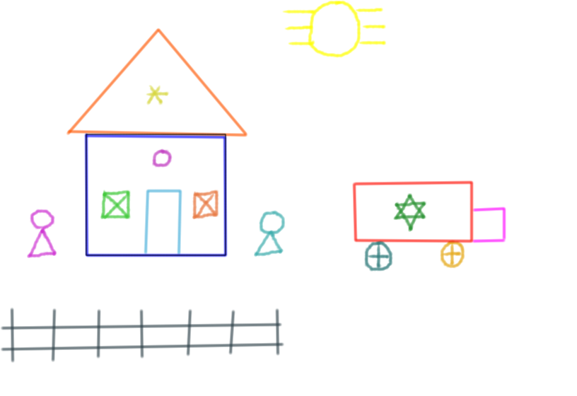

# Funciones auxiliares {#auxiliares}

En este capítulo se presentan funciones auxiliares que son útiles para complementar los gráficos generados en R.

## Función `segments`
Esta función es muy útil para digujar segmentos. La estructura de la función se muestra a continuación.

```{r, eval=FALSE}
segments(x0, y0, x1 = x0, y1 = y0, ...)
```

Los argumentos de la función son:

- `xo, yo`: coordenadas del punto de inicio del segmento.
- `x1, y1`: coordenadas del punto de fin del segmento.
- `...`: otros parámetros gráficos.

A continuación de muestra el código para dibujar con segmentos la sigla de la Universidad Nacional de Colombia (UN), en la Figura \@ref(fig:seg1) se puede ver el resultado.

```{r seg1, fig.cap='Ejemplos de segmentos.', fig.asp=0.6, fig.width=6}
plot(c(-11, 3), c(-10, 10), type="n", xlab="", ylab="")
grid()

segments(-9, 9, -9, -9, lwd=4, col=3)
segments(-9, -9, -5, -9, lwd=4, col=3)
segments(-5, -9, -5, 9, lwd=4, col=3)

segments(-4, -9, -4, 9, lwd=4)
segments(-4, 9, 0, -9, lwd=4)
segments(0, -9, 0, 9, lwd=4)
```

## Función `rect`
Esta función es muy útil para digujar rectángulos. La estructura de la función se muestra a continuación.

```{r, eval=FALSE}
rect(xleft, ybottom, xright, ytop,
     density = NULL, angle = 45, ...)
```

Los argumentos de la función son:

- `xleft`: vector o escalar con la posición de x a izquierda.
- `ybottom`: vector o escalar con la posición de y abajo.
- `xright`: vector o escalar con la posición de x a derecha.
- `ytop`: vector o escalar con la posición de y arriba.
- `density`: número de líneas por pulgada con la cuales se rellenará el rectángulo.
- `angle`: ángulo de inclinación de la líneas de relleno.
- `col`: color para el fondo del rectángulo.
- `border`: color para el borde del rectángulo, un valor posible es `'transparent'` cuando no se desea borde.
- `...`: otros parámetros gráficos.

En la Figura \@ref(fig:rect1) se muestran 7 rectángulos de ejemplo que fueron obtenidos al variar los parámetros de la función `rect`, a continuación el código usado para obtener esa figura.

```{r rect1, fig.cap='Ejemplos de rectángulos.', fig.asp=0.8, fig.width=8}
plot(NA, xlim=c(10, 20), ylim=c(10, 30), las=1, xlab='', ylab='')
rect(10, 28, 12, 30)
rect(11, 25, 13, 27, col='red')
rect(12, 22, 14, 24, density=5)
rect(13, 19, 15, 21, density=5, angle=15)
rect(14, 16, 16, 18, col='pink', border='blue')
rect(15, 13, 17, 15, lty='dashed')
rect(16, 10, 18, 12, lwd=3)

text(14, 26, "col='red'")
text(15, 23, "density=5")
text(17, 20, "density=5, angle=15")
text(18.2, 17, "col='pink', border='blue'")
text(18.2, 14, "lty='dashed'")
text(18.8, 11, "lwd=3")
```

El código mostrado abajo pertenece a la ayuda de la función `rect` y el resultado es la Figura \@ref(fig:rect2). De esta figura se observa que es posible dibujar varios rectángulos ingresando las coordenadas como vectores.

```{r rect2, fig.cap='Ejemplo de rectángulos obtenidos con `rect`.', fig.asp=0.8, fig.width=8}
## set up the plot region:
plot(c(100, 250), c(300, 450), type="n", xlab="", ylab="",
     main="2 x 11 rectangles; 'rect(100+i,300+i, 150+i,380+i)'")
i <- 4*(0:10)
## draw rectangles with bottom left (100, 300)+i
## and top right (150, 380)+i
rect(100+i, 300+i, 150+i, 380+i, col=rainbow(11, start=0.7, end=0.1))
rect(240-i, 320+i, 250-i, 410+i, col=heat.colors(11), lwd=i/5)
```

## Función `polygon`
Esta función es muy útil para dibujar polígonos. La estructura de la función se muestra a continuación.

```{r, eval=FALSE}
polygon(x, y, density = NULL, angle = 45,
        border, col, lty, ...)
```

Los argumentos de la función son:

- `x, y`: vectores con las coordenadas de ubicación de los puntos que forman el polígono.
- `density`: número de líneas por pulgada con la cuales se rellenará el polígono.
- `angle`: ángulo de inclinación de la líneas de relleno.
- `border`: color para el borde del polígono, un valor posible es `'transparent'` cuando no se desea borde.
- `col`: color para el fondo del rectángulo.
- `lty`: tipo de línea a usar para el borde.
- `...`: otros parámetros gráficos.

A continuación se muestra como usar la función `polygon` para dibujar un triángulo y un cuadrilátero. En la Figura \@ref(fig:poly1) se muestran las figuras obtenidas.

```{r poly1, fig.cap='Ejemplo de formas obtenidas con `polygon`.', fig.asp=1, fig.width=3.5}
plot(0:5, 0:5, type="n", xlab="", ylab="")
abline(v=0:5, h=0:5, col=gray(0.8), lty='dashed')

polygon(x=c(0, 1, 2), y=c(1, 5, 2),         # Para el triangulo
        col='blue', border='red', lwd=4)

polygon(x=c(3, 5, 5, 2), y=c(5, 4, 1, 1), # Para el cuadrilatero
        col='orange', border='darkgreen', lwd=4)
```

## Función `abline`
Esta función es muy útil para dibujar líneas rectas dada la ecuación $y=a+bx$, donde $a$ representa el intercepto y $b$ la pendiente de la recta. La estructura de la función se muestra a continuación.

```{r, eval=FALSE}
abline(a = NULL, b = NULL, h = NULL, v = NULL, reg = NULL,
       coef = NULL, untf = FALSE, ...)
```

Los argumentos de la función son:

- `a, b`: son los coeficientes de la ecuación, `a` representa el intercepto y `b` la pendiente.
- `h`: es el valor del eje Y por donde queremos que pase una __recta horizontal__.
- `v`: es el valor del eje X por donde queremos que pase una __recta vertical__.
- `coef`: vector de dos elementos con el intercepto y pendiente.
- `reg`: objeto de clase `lm` resultante de haber usado la función `lm`.
- `...`: otros parámetros gráficos.

A continuación de muestra el código para dibujar la recta $y=-5+3x$. En la Figura \@ref(fig:abline1) se puede ver el resultado.

```{r abline1, fig.cap='Ejemplo de una recta con la función abline.', fig.asp=1, fig.width=3.3}
plot(x=c(-5, 5), y=c(-10, 10),    # Para crear el lienzo
     xlab="", ylab="", type='n')  # donde se ubicará la recta

abline(a=-5, b=3, lwd=3, col='blue')
```

A continuación de muestra el código para dibujar tres rectas, la de color verde debe ser horizontal y pasar por $y=5$, la de color rojo debe ser horizontal y pasar por $y=-3$ y la última debe ser vertical, de color naranja y pasar por $x=2$. En la Figura \@ref(fig:abline2) se puede ver el resultado.

```{r abline2, fig.cap='Ejemplo de una recta con la función abline.', fig.asp=1, fig.width=3.3}
plot(x=c(-5, 5), y=c(-10, 10),    # Para crear el lienzo
     xlab="", ylab="", type='n')  # donde se ubicará la recta

abline(h=c(5, -3), v=2,
       col=c('darkgreen', 'red', 'orange'), lwd=5)
```

## Para dibujar un círculo
En la base de R no hay una función específica para crear círculos, sin embargo, es posible usar unas pocas líneas para obtener el círculo con un radio y centro deseado por medio de la función `polygon`. A continuación se muestra el código para dibujar un círculo de radio 7 unidades con centro en el punto (-2, 1) con fondo azul claro y borde de color azul obscuro. En la Figura \@ref(fig:circ1) se muestra el círculo construído.

```{r circ1, fig.cap='Ejemplo de un círculo.', fig.asp=1, fig.width=4}
rad     <- 7   # Valor del radio
xcenter <- -2  # Coordenada en x del centro
ycenter <- 1   # Coordenada en y del centro

plot(c(-10, 10), c(-10, 10), type="n", xlab="", ylab="", asp=1)
theta <- seq(0, 2 * pi, length = 200)
polygon(x=rad * cos(theta) + xcenter,
        y=rad * sin(theta) + ycenter,
        lwd=3, col='steelblue1', border='steelblue4')
grid()  # Para incluir una cuadrícula de guía
```

## Función `arrows`
Esta función es muy útil para incluir flechas en una figura. La estructura de la función se muestra a continuación.

```{r, eval=FALSE}
arrows(x0, y0, x1=x0, y1=y0, length=0.25, angle=30, ...)
```

Los argumentos de la función son:

- `x0, y0`: coordenadas de inicio de la flecha.
- `x1, y1`: coordenadas de fin de la flecha.
- `length`: longitud (en pulgadas) de los bordes de punta de la flecha, el valor por defecto es 0.25.
- `angle`: ángulo para la punta de la flecha, a mayor ángulo más abiertas las puntas.
- `code`: número entero para indicar el tipo de flecha a dibujar. El valor de 0 para una flecha sin punta (entonces no sería una flecha), el valor de 1 para una flecha apuntando al revés (no es frecuente), el valor de 2 (valor por defecto) para una flecha usual y valor de 3 para colocar puntas a ambos lados de la flecha. El valor por defecto son 30 grados.
- `...`: otros parámetros gráficos.

En la Figura \@ref(fig:arrow1) se muestran los cuatro tipos de flechas que se obtienen al variar el parámetro `code` de la función `arrows`. Note que la flecha de la derecha fue construída subiendo, pero como `code=1` ella quedó bajando.

```{r arrow1, fig.cap='Ejemplos de flechas variando el parámetro `code`.', fig.asp=0.8, fig.width=6}
plot(NA, xlab='X', ylab='Y',      # Para crear un gráfico vacío
     xlim=c(0, 6), ylim=c(0, 5))
arrows(x0=2, y0=1, x1=4, y1=1, code=0)
arrows(x0=5, y0=1, x1=5, y1=4, code=1)
arrows(x0=2, y0=4, x1=4, y1=4, code=2)
arrows(x0=1, y0=1, x1=1, y1=4, code=3)
text(3, 0.8, 'code=0')
text(5.4, 2.5, 'code=1')
text(3, 4.2, 'code=2')
text(0.6, 2.5, 'code=3')
```

En la Figura \@ref(fig:arrow2) se muestran 4 flechas para varios valores del parámetro `angle`, de la figura se observa que entre mayor el ángulo, la punta de la fecha es más achatada.

```{r arrow2, fig.cap='Ejemplos de flechas variando el parámetro `angle`.', fig.asp=0.8, fig.width=6}
plot(NA, xlab='X', ylab='Y',      # Para crear un gráfico vacío
     xlim=c(0, 6), ylim=c(0, 5))

arrows(x0=1, y0=4, x1=4, y1=4)
arrows(x0=1, y0=3, x1=4, y1=3, angle=45)
arrows(x0=1, y0=2, x1=4, y1=2, angle=60)
arrows(x0=1, y0=1, x1=4, y1=1, angle=90)
text(4.5, 3, 'angle=45')
text(4.5, 2, 'angle=60')
text(4.5, 1, 'angle=90')
```

## Función `grid`
La función `grid` es muy útil para construir rejillas sobre un gráfico, estas rejillas se pueden usar como referencia para facilitar la interpretación o como guía para ubicar elementos en un dibujo.

La estructura de la función se muestra a continuación.

```{r, eval=FALSE}
grid(nx = NULL, ny = nx, col = "lightgray", lty = "dotted",
     lwd = par("lwd"), equilogs = TRUE)
```

Los argumentos de la función son:

- `nx, ny`: número de celdas a dibujar tanto en el eje horizontal y vertical.
- `col`: color de la rejilla.
- `lty`: tipo de línea a usar.
- `lwd`: grosor de la rejilla.

A continuación se muestran dos ejemplos de como usar `grid`. En el primer ejemplo se dibuja un gráfico vacío y se le agrega la rejila estándar que se puede obtener con `grid()` sin definir ningún parámetro. En el segundo ejemplo se tiene una rejilla que divide en 4 partes el eje horizontal (`nx=3`), en 4 partes el eje vertical (`ny=4`), de color rosado, grosor 2 y con guiones largos. Abajo el código utilizado y en la Figura \@ref(fig:grid1) se observan los resultados.

```{r grid1, fig.cap='Ejemplos de rejillas con `grid`.', fig.asp=0.5, fig.width=5}
par(mfrow=c(1, 2), mar=c(2, 2, 0, 0), cex=0.5)
plot(c(-10, 10), c(-10, 10), type="n", xlab="", ylab="")
grid()

plot(c(-10, 10), c(-10, 10), type="n", xlab="", ylab="")
grid(nx=3, ny=4, col="pink", lwd=2, lty="longdash")
```

```{block2, type='rmdtip'}
Para dibujar rejillas en puntos seleccionados por el usuario se puede utilizar el procedimiento explicado en la sección \@ref(rejper).
```

```{block2, type='rmdwarning'}
Se recomienda agregar la rejilla a un gráfico antes de poner el contenido (puntos o líneas) para que no interfiera.
```

## Función `points`
Esta función es útil para agregar puntos a una figura ya creada. La estructura de la función es la siguiente.

```{r, eval=FALSE}
points(x, y, pch, col, cex)
```

Los argumentos de la función son:

- `x, y`: vectores con las coordenadas de ubicación de los puntos.
- `pch`: valor o vector numérico con el tipo de punto a usar, por defecto `pch=1`.
- `col`: vector con los colores para cada punto.
- `cex`: número para modificar el tamaño de los puntos, por defecto es `cex=1` y al aumentar su valor aumenta el tamaño de los puntos.

Los diferentes tipos de puntos que se pueden obtener al variar el parámetro `pch` se muestran en la Figura \@ref(fig:point1).

```{r point1, fig.cap='Ejemplos de los tipos de puntos obtenidos al variar `pch`.', fig.asp=0.5, fig.width=6, echo=FALSE}
par(bg='azure2', mar=c(1, 0, 0, 0))
plot(c(0, 14), c(4, 5.3), type="n", axes=F, 
     xlab="", ylab="")
points(x=1:13, y=rep(5, 13), pch=0:12, cex=2)
text(x=1:13,   y=rep(5.2, 13), labels=0:12)

points(x=1:13, y=rep(4, 13), pch=13:25, cex=2)
text(x=1:13,   y=rep(4.2, 13), labels=13:25)
```

Es posible usar otros símbolos personalizados en el parámetro `pch`, a continuación se muestra el código para incluir 5 puntos usando los símbolos @, ., $, % y w. En la Figura \@ref(fig:point2) se observan los 5 puntos con los símbolos usados. Observe que cuando se usó `pch='.'` aparece un pequeño punto, casi imperceptible, esta opción es muy usada cuando se tiene muchos puntos que se traslapan entre si.

```{r point2, fig.cap='Ejemplos de símbolos personalizados con `pch`.', fig.asp=0.8, fig.width=3}
par(mar=c(2, 2, 0, 0))
plot(c(0.5, 5.5), c(0.5, 5.5), xlab="", ylab="", type='n')
points(x=1:5, y=1:5,
       pch=c('@', '.', '$', '%', 'w'),
       col=1:5)
```

## Función `curve`
Esta función sirve para dibujar una curva en un intervalo dado. La estructura de la función es la siguiente.

```{r, eval=FALSE}
curve(expr, from = NULL, to = NULL, n = 101, add = FALSE,
      type = "l", log = NULL, xlim = NULL, ...)
```

Los argumentos de la función son:

- `expr`: nombre de la función que se desea evaluar.
- `from, to`: valores mínimo y máximo donde se va a evaluar la función.
- `n`: número de puntos en los cuales se va a evaluar la función, su valor por defecto es 101.
- `add`: valor lógico para indicar que se desea agregar la curva a un gráfico ya existente.
- `type`: tipo de representación para la función, se disponen de 9 opciones que se pueden consultar en descripción de `type` para la función `plot` en la sección \@ref(type).
- `xlim`: intervalo para construir la ventana gráfica, no confundir con `from` y `to`.

### Ejemplo {-}
Dibujar las funciones $f_1$, $f_2$ y $f_3$ usando la función `curve`, las ecuaciones para las funciones son:

\begin{align}
f_1(x) &= x^2-10 \\
f_2(x) &= \begin{cases} x^2-10, & \mbox{si } x < 1 \\ 5 x, & \mbox{si } x \geq 1 \end{cases} \\
f_3(x) &=15-4x
\end{align}

Dibujar $f_1$ en el intervalo [-2, 7], $f_2$ en el intervalo [-2, 4] y $f_3$ en el intervalo [-5, 0].

El código necesario para definir las dos funciones se muestra a continuación. Para dibujar $f_2$ y $f_3$ se usó `add=TRUE` con el objetivo de que quedaran en la misma ventana gráfica de $f_1$. Note que se usó `xlim=c(-5, 10)` para indicar que se deseaba una ventana gráfica en ese intervalo para el eje horizontal. En la Figura \@ref(fig:curve1) se muestra el dibujo de las tres funciones.

```{r curve1, fig.cap='Dibujo de varias funciones en una misma ventana.', fig.asp=0.8, fig.width=8}
f1 <- function(x) x^2 - 10
f2 <- function(x) ifelse(x < 1, -x^2, 5*x)
f3 <- function(x) 15 - 4 * x

curve(expr=f1, from=-2, to=7, type="l",
      col="blue", lwd=4, ylab='f(x)', xlim=c(-5, 10))

curve(expr=f2, from=-2, to=4, type="p",
      col="green4", add=TRUE)

curve(expr=f3, from=-5, to=0, type="b",
      col='red', add=TRUE, n=5)

text(x=7, y=9, "f1(x) usando type='l'", col="blue")
text(x=-2, y=4, "f2(x) usando type='p'", col="green4")
text(x=-1, y=30, "f3(x) usando type='b' y n=5", col="red")
```

### Ejemplo {-}
Dibujar la figura de la relación entre las variables $x$ y $y$ dada por la siguiente expresión paramétrica:

\begin{align}
x &= 16 \cos^3(t) \\
y &= 13 \cos(t)-5 \cos(2t)-2 \cos(3t)- \cos(4t)
\end{align}

El código para realizar la Figura \@ref(fig:curve2) fue tomado de [Stackoverflow](http://stackoverflow.com/questions/8082429/plot-a-heart-in-r) y se muestra a continuación.

```{r curve2, fig.cap='Dibujo de un cardiode.', fig.asp=1, fig.width=3.5}
dat <- data.frame(t=seq(0, 2*pi, by=0.1))
xhrt <- function(t) 16*sin(t)^3
yhrt <- function(t) 13*cos(t)-5*cos(2*t)-2*cos(3*t)-cos(4*t)
dat$y <- yhrt(dat$t)
dat$x <- xhrt(dat$t)
with(dat, plot(x,y, type="l", lwd=10))
with(dat, polygon(x, y, col="hotpink"))
```


```{r, echo=F}
## Función `abline` \index{abline}
## Función `legend` \index{legend} \index{leyendas}
## Función `text` \index{text} \index{texto}
## Función `lines` \index{lines} \index{líneas}
## Función `identify` \index{identify} \index{identificador}
## Función `locator` \index{locator} 
## Función `axes` \index{axes} \index{ejes}
## Función `title` \index{title} \index{títulos}
## Función `mtext` \index{mtext} 
## Función `rug` \index{rug} 
```


## EJERCICIOS {-}

1. Crear un gráfico vacío de manera que el eje horizontal tome valores desde 0 a 30 y el eje vertical valores de 0 a 20, usar los pasos de la sección \@ref(emptygraph) para construir el gráfico solicitado.


2. Para el gráfico vacío creado en el paso anterior, agregar una rejilla o cuadrícula que pase por los valores enteros, use los pasos de la sección \@ref(rejper) para incluir la rejilla en los valores solicitados. El gráfico resultante de los ejercicios 1 y 2 debe ser similar al presentando en la Figura \@ref(fig:plantilla).

```{r plantilla, fig.cap='Plantilla para el dibujo.', fig.asp=0.8, fig.width=3.4, echo=FALSE}
par(mar=c(2, 2, 0, 0))
plot(c(0, 30), c(0, 20), type="n", xlab="", ylab="")
abline(v=0:30, h=0:20, col=gray(0.8), lty='dashed')
```

3. Incluir en el gráfico vacío y con rejillas anterior el dibujo mostrado en la Figura \@ref(fig:casita). Use las funciones vistas en este capítulo para replicar el dibujo del paisaje e incluya colores para mejorar la apariencia del paisaje.

```{r casita, echo=F, fig.cap='Paisaje a dibujar.', dpi=250, fig.align='center'}

```

4. Dibujar las siguientes dos líneas en un mismo gráfico, la primera de color azul y la segunda de color verde.
\begin{align*} 
2x - 5y &=  8 \\ 
3x + 9y &=  -12
\end{align*}

5. Dibujar la siguiente figura dada en forma parametrica.
\begin{align*} 
x &=  \cos(t) \\ 
y &=  \sin(t)
\end{align*}

